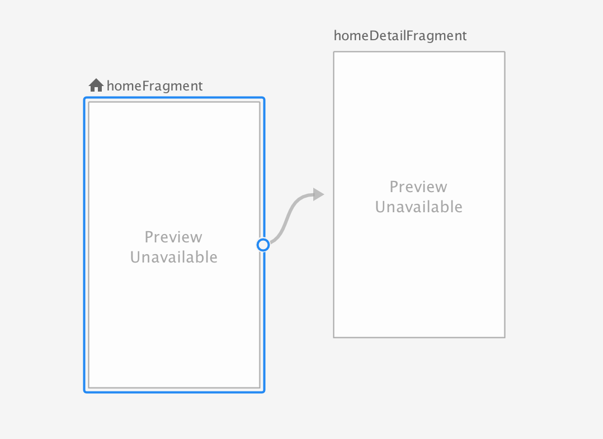

# Mastering the Bottom Navigation with the new _Navigation_ Architecture Component

The demo-app shows the usage of the new _Navigation Architecture Component_ in colaboration with the _Bottom Navigation bar_.

## Bottom Navigation

The _bottom navigation_ was introduced 2 years ago as a material design pattern. The goal was to give the user quick access to 3-5 top-level destinations in an Android app, but an appropriate implementation was missing for long time.
Meanwhile Goole introduced the [Bottom Navigation bar](https://material.io/design/components/bottom-navigation.html#usage) as an implementation.  

The common architectual approach for such a top level navigation would be to make use of Fragments which are added/replaced in a `FrameLayout` serving as a holder in the Activity's view hierarchy. The `FragmentManager` used for dealing with fragments within an Activity only knows _one_ backstack. Building up a backstack for each single view section accessable by the _Bottom Navigation bar_ was impossible. Therefore the "old" pattern behavior was about to remove the whole backstack when the user switched from one section to another.

But this wasn't the best user experience. Other approaches popped up, like the [Conductor framework](https://github.com/bluelinelabs/Conductor) making it possible to maintain different controller-based backstacks attached to different _Router_'s used in one Activity.

The "new" pattern behavior is about to maintain the view state a user left in one section when navigating back to it.

## Navigation Architecture Component

With the new [Navigation Architecture Component](https://developer.android.com/topic/libraries/architecture/navigation/) Google introduces a similar concept which uses a `NavHostFragment` hosting a `NavController` operating on a _navigation graph_.

```
<fragment
    android:id="@+id/section_home"
    android:name="androidx.navigation.fragment.NavHostFragment"
    android:layout_width="match_parent"
    android:layout_height="match_parent"
    app:defaultNavHost="true"
    app:navGraph="@navigation/nav_graph"
    />
```
Placing this xml snippet into your Activity gives you access to it's `NavController`  managing the navigation within the `NavHost`. Based on the _navigation graph_ it allows to navigate to another fragment defined as an `action` or to pop the backstack.

```
<navigation xmlns:android="http://schemas.android.com/apk/res/android"
            xmlns:app="http://schemas.android.com/apk/res-auto"
            app:startDestination="@id/homeFragment"
    >
    <fragment
        android:id="@+id/homeFragment"
        android:name="com.dirkeisold.navigation.usecase.home.HomeFragment"
        android:label="HomeFragment">

        <action
            android:id="@+id/action_homeFragment_to_homeDetailFragment"
            app:destination="@id/homeDetailFragment"
            />
    </fragment>
    <fragment
        android:id="@+id/homeDetailFragment"
        android:name="com.dirkeisold.navigation.usecase.detail.DetailFragment"
        android:label="HomeDetailFragment">
    </fragment>

</navigation>
```

## Mastering several view sections of the _Bottom Navigation bar_

To maintain a fragment backstack for each view section of the _Bottom Navigation bar_ a possible solution would be to use several `NavHostFragments`: 

```
  <FrameLayout
        android:id="@+id/section_home_wrapper"
        android:layout_width="match_parent"
        android:layout_height="0dp"
        app:layout_constraintBottom_toTopOf="@id/navigation"
        app:layout_constraintTop_toTopOf="parent"
        >

        <fragment
            android:id="@+id/section_home"
            android:name="androidx.navigation.fragment.NavHostFragment"
            android:layout_width="match_parent"
            android:layout_height="match_parent"
            app:defaultNavHost="false"
            app:navGraph="@navigation/nav_graph_section_home"
            />
    </FrameLayout>

    <FrameLayout
        android:id="@+id/section_dashboard_wrapper"
        android:layout_width="match_parent"
        android:layout_height="0dp"
        android:visibility="invisible"
        app:layout_constraintBottom_toTopOf="@id/navigation"
        app:layout_constraintTop_toTopOf="parent">

        <fragment
            android:id="@+id/section_dashboard"
            android:name="androidx.navigation.fragment.NavHostFragment"
            android:layout_width="match_parent"
            android:layout_height="match_parent"
            app:defaultNavHost="false"
            app:navGraph="@navigation/nav_graph_section_dashboard"
            />
    </FrameLayout>

    <FrameLayout
        android:id="@+id/section_notification_wrapper"
        android:layout_width="match_parent"
        android:layout_height="0dp"
        android:visibility="invisible"
        app:layout_constraintBottom_toTopOf="@id/navigation"
        app:layout_constraintTop_toTopOf="parent">

        <fragment
            android:id="@+id/section_notification"
            android:name="androidx.navigation.fragment.NavHostFragment"
            android:layout_width="match_parent"
            android:layout_height="match_parent"
            app:defaultNavHost="false"
            app:navGraph="@navigation/nav_graph_section_notifications"
            />
    </FrameLayout>
```
Each navigation host (_NavHostFragment_) contains its own `NavController` based on a specific _Navigation Graph_ and maintains its own Fragment backstack. Initally only the first `FrameLayout` containing the home section will be visible to the user. When switching view sections the appropriate `FrameLayout` will be shown to the user, the others hidden. The view state of each view section backed by a `NavHostFragment` and its `NavController` will be maintained and not changed.

## Android Studio 3.2

The _Android Studio 3.2_ provides a nice graphical editor for designing a _Navigation Graph_.



Finally, Google comes up with a useful architecture component for implementing a _Navigation Graph_ programmatically and visually, too.
